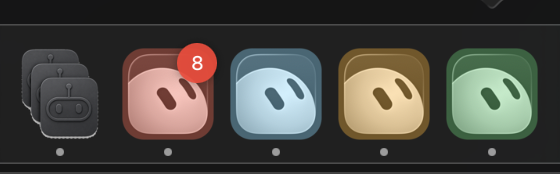

# Lots of Agents

**Run multiple signed-in copies of your AI coding apps on one Mac.**

Grok Bot, Cursor, Claude, and ChatGPT (Codex) don’t give you a clean work/personal switcher. Lots of Agents launches the **same installed app** with a private data folder per clone — so Work and Personal stay signed in at the same time.

One binary. Update once. Every clone picks it up. No copying `.app` bundles.

Not affiliated with xAI, Anysphere, Anthropic, or OpenAI.

<p align="center">
  
</p>

**Download:** [Latest Release](https://github.com/carllippert/lots_of_agents/releases/latest) (`Lots-of-Agents-unsigned.zip`)

---

## Agent setup (copy this)

If you are an AI agent installing this for a human on their Mac, follow **only** this section. Do not notarize. Do not open a PR. Do not invent alternate install paths.

**Prefer the Release zip** (no Swift toolchain needed). Fall back to building from source only if the download fails.

### 0. Preconditions (fail fast)

Run on the target Mac (macOS 14+). Confirm at least one supported app:

```bash
sw_vers
ls -d \
  "/Applications/Grok Bot.app" \
  "/Applications/Cursor.app" \
  "/Applications/Claude.app" \
  "/Applications/ChatGPT.app" 2>/dev/null
```

If none of those apps exist, tell the human to install Grok Bot, Cursor, Claude, and/or ChatGPT first. This repo does **not** ship those apps.

### 1a. Preferred — install from GitHub Release

```bash
cd /tmp
curl -sL "https://github.com/carllippert/lots_of_agents/releases/latest/download/Lots-of-Agents-unsigned.zip" -o Lots-of-Agents-unsigned.zip
rm -rf "Lots of Agents.app"
unzip -o Lots-of-Agents-unsigned.zip
mkdir -p "$HOME/Applications"
rm -rf "$HOME/Applications/Lots of Agents.app"
mv "Lots of Agents.app" "$HOME/Applications/"
xattr -dr com.apple.quarantine "$HOME/Applications/Lots of Agents.app" 2>/dev/null || true
open "$HOME/Applications/Lots of Agents.app"
```

### 1b. Fallback — clone and build

Needs Command Line Tools (`xcode-select --install`) and `swift`:

```bash
xcode-select -p
swift --version
git clone https://github.com/carllippert/lots_of_agents.git
cd lots_of_agents
swift run TwoCursorsTests
./scripts/build-app.sh
mkdir -p "$HOME/Applications"
rm -rf "$HOME/Applications/Lots of Agents.app"
cp -R "dist/Lots of Agents.app" "$HOME/Applications/"
xattr -dr com.apple.quarantine "$HOME/Applications/Lots of Agents.app" 2>/dev/null || true
open "$HOME/Applications/Lots of Agents.app"
```

### 2. What the human does in the UI (you cannot fully automate this)

1. In **Lots of Agents**, click **New Clone** (or an app icon on the landing screen).
2. Pick an installed app (Grok Bot / Cursor / Claude / ChatGPT).
3. Name it (e.g. `Work` or `Personal`) → create.
4. Select the clone → **Launch**.
5. Sign in inside that app window with the correct account.
6. Repeat for a second clone if they want two logins.

Dock wrappers appear as e.g. `Grok Bot Work.app` in `~/Applications`.

### 3. Verify

```bash
test -d "$HOME/Applications/Lots of Agents.app" && echo "app installed"
ls "$HOME/Library/Application Support/LotsOfAgents/profiles.json" 2>/dev/null && echo "catalog exists"
ls "$HOME/Applications" | grep -E 'Grok Bot|Cursor|Claude|ChatGPT' || true
```

After they create a clone, `profiles.json` should list it and a wrapper `.app` should exist under `~/Applications`.

### 4. Gatekeeper / “blocked” app

Ad-hoc builds are normal. If macOS blocks launch:

```bash
xattr -dr com.apple.quarantine "$HOME/Applications/Lots of Agents.app"
```

Then: **right-click the app → Open → Open**, or System Settings → Privacy & Security → **Open Anyway**.

### Do not

- Do not require Apple Developer ID or notarization for a personal install
- Do not copy Grok/Cursor/Claude/ChatGPT into this project
- Do not store clones under a fake/sandbox `$HOME` (Parall, etc.) — the app writes to the real account home via `getpwuid`
- Do not `sudo` anything for this install

---

## Who it’s for

You have two Cursor / Grok / Claude / ChatGPT logins (work + personal, client + side project) and you’re tired of signing out, using a second Mac user, or juggling browser profiles.

## What you get

- **Isolated logins & chats** — each clone has its own `--user-data-dir` / extensions dir
- **Shared app updates** — still the official app in `/Applications`
- **Dock wrappers** — `Grok Bot Work.app`, `Cursor Personal.app`, etc. in `~/Applications`
- **Optional deeper isolation** — private `~/.cursor` (skills / user rules) via a full-home overlay that still symlinks your real home
- **Tinted icons** — tell clones apart in the Dock

Supported today (if installed under `/Applications`):

| App | Notes |
|---|---|
| [Grok Bot](https://cursor.com/bot/onboarding) | Bundle ID `com.anysphere.sand` |
| [Cursor](https://cursor.com) | Same clone model |
| [Claude](https://claude.ai/download) | `com.anthropic.claudefordesktop` |
| [ChatGPT](https://chatgpt.com/desktop) (Codex) | `com.openai.codex` — app is named ChatGPT.app |

## How a clone works

```text
/Applications/Grok\ Bot.app/Contents/MacOS/Grok\ Bot \
  --user-data-dir=~/Library/Application\ Support/LotsOfAgents/Profiles/<id>/user-data \
  --extensions-dir=…/extensions
```

| Isolated per clone | Shared |
|---|---|
| Account / plan login | The real `.app` + its updates |
| Chats, settings, extensions | Git, SSH, project files |
| Optional private `~/.cursor` | Your real home (symlinked in overlay mode) |

- Catalog / data: `~/Library/Application Support/LotsOfAgents/`
- Wrappers: `~/Applications/`

## Human install (no agent)

1. Download [Lots-of-Agents-unsigned.zip](https://github.com/carllippert/lots_of_agents/releases/latest/download/Lots-of-Agents-unsigned.zip)
2. Unzip → move **Lots of Agents.app** to `~/Applications`
3. Clear quarantine (or right-click → Open):

```bash
xattr -dr com.apple.quarantine ~/Applications/"Lots of Agents.app"
open ~/Applications/"Lots of Agents.app"
```

Or build from source: `./scripts/build-app.sh` → copy `dist/Lots of Agents.app`.

Notarized DMG (optional, Apple Developer ID required): [docs/NOTARIZE.md](docs/NOTARIZE.md).

## Uninstall

```bash
rm -rf "$HOME/Applications/Lots of Agents.app"
# Optional: remove clones + wrappers you created
# rm -rf "$HOME/Library/Application Support/LotsOfAgents"
# rm -rf "$HOME/Applications/Grok Bot "*.app   # only Lots-of-Agents wrappers you no longer want
```

Removing Lots of Agents does **not** uninstall Grok/Cursor/Claude/ChatGPT.

## Privacy

Runs only on your Mac. No analytics. See [PRIVACY.md](PRIVACY.md).

## License

[MIT](LICENSE)
