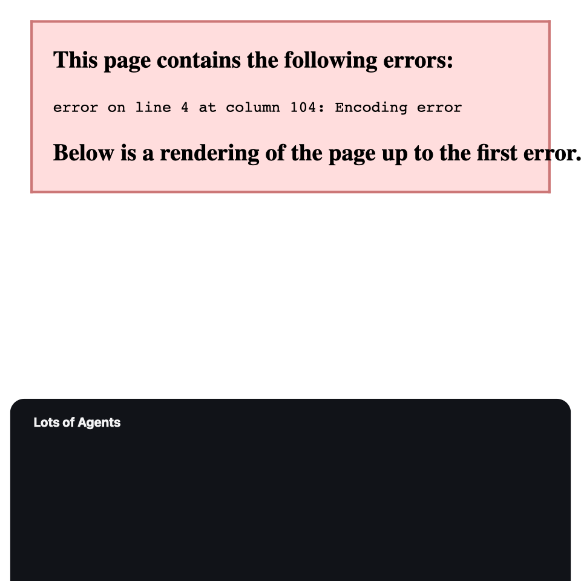

# Lots of Agents

Grok Bot has no account switcher. Lots of Agents launches the **same** `/Applications/Grok Bot.app` with a separate data directory so you can stay signed into work and personal Cursor-tier logins on one Mac.

One Grok Bot binary. Update once. Both clones pick it up. Also clones [Cursor](https://cursor.com).

Not affiliated with xAI or Anysphere.



## Requirements

- macOS 14+
- [Grok Bot](https://cursor.com/bot/onboarding) installed at `/Applications/Grok Bot.app` (bundle ID `com.anysphere.sand`)
- Cursor is optional; clones work the same way if `/Applications/Cursor.app` is present

## Download

**Strangers should only install a notarized DMG.** Gatekeeper rejects ad-hoc builds.

| Artifact | Who |
|---|---|
| Notarized universal DMG (GitHub Releases v1.0) | Everyone |
| Unsigned zip (`dist/Lots-of-Agents-unsigned.zip`) | Developers who will `xattr -dr com.apple.quarantine` themselves |

This repo does **not** ship Grok Bot.app or Cursor.app.

## How clones work

Each Grok clone launches the official binary:

```text
/Applications/Grok Bot.app/Contents/MacOS/Grok Bot \
  --user-data-dir=<profile>/user-data \
  --extensions-dir=<profile>/extensions
```

| Isolated | Shared |
|---|---|
| Cursor-tier login / plan | Grok Bot.app binary + updates |
| Chats and settings | Git / SSH / your real home |
| Optional private `~/.cursor` (full-home overlay) | Project files on disk |

**Never** Parall’s incomplete fake home. The optional overlay symlinks *every* top-level item from your real home and only keeps `.cursor` as a real per-clone directory.

OAuth uses `sand://`. Sign-in mode pauses other **Grok** clones so the callback reaches the one you are authorizing. Cursor clones use `cursor://` the same way and are paused separately.

## App features

- Detects Grok Bot by bundle ID `com.anysphere.sand` (display name is not enough)
- Status banner: Grok Bot installed yes/no, running yes/no
- Create Work / Personal clones with native icons (edit in place, no recreate)
- Wrapper apps in `~/Applications` (`Grok Bot Work.app`, …)
- One **Update Grok Bot** button that opens the official app
- Cursor as a second recipe in the sidebar
- Optional `~/.local/bin` shims

Data lives in `~/Library/Application Support/LotsOfAgents/`.

## Build from source

```bash
swift run TwoCursorsTests
./scripts/build-app.sh
open "dist/Lots of Agents.app"
```

`build-app.sh` produces a **universal** (arm64 + x86_64) app. By default it is ad-hoc signed (developers only).

Developer-only zip (still unsigned / ad-hoc):

```bash
./scripts/package-unsigned.sh
```

## Notarize (required before Reddit)

Needs a Developer ID Application certificate and a notarytool keychain profile:

```bash
./scripts/build-app.sh
./scripts/notarize.sh
./scripts/make-dmg.sh
```

See [docs/NOTARIZE.md](docs/NOTARIZE.md). Do not post a download link until the DMG is stapled and Gatekeeper accepts it.

## Launch copy

Draft posts (do not publish until the notarized DMG exists): [docs/LAUNCH.md](docs/LAUNCH.md)

## License

[MIT](LICENSE). [Privacy](PRIVACY.md).
