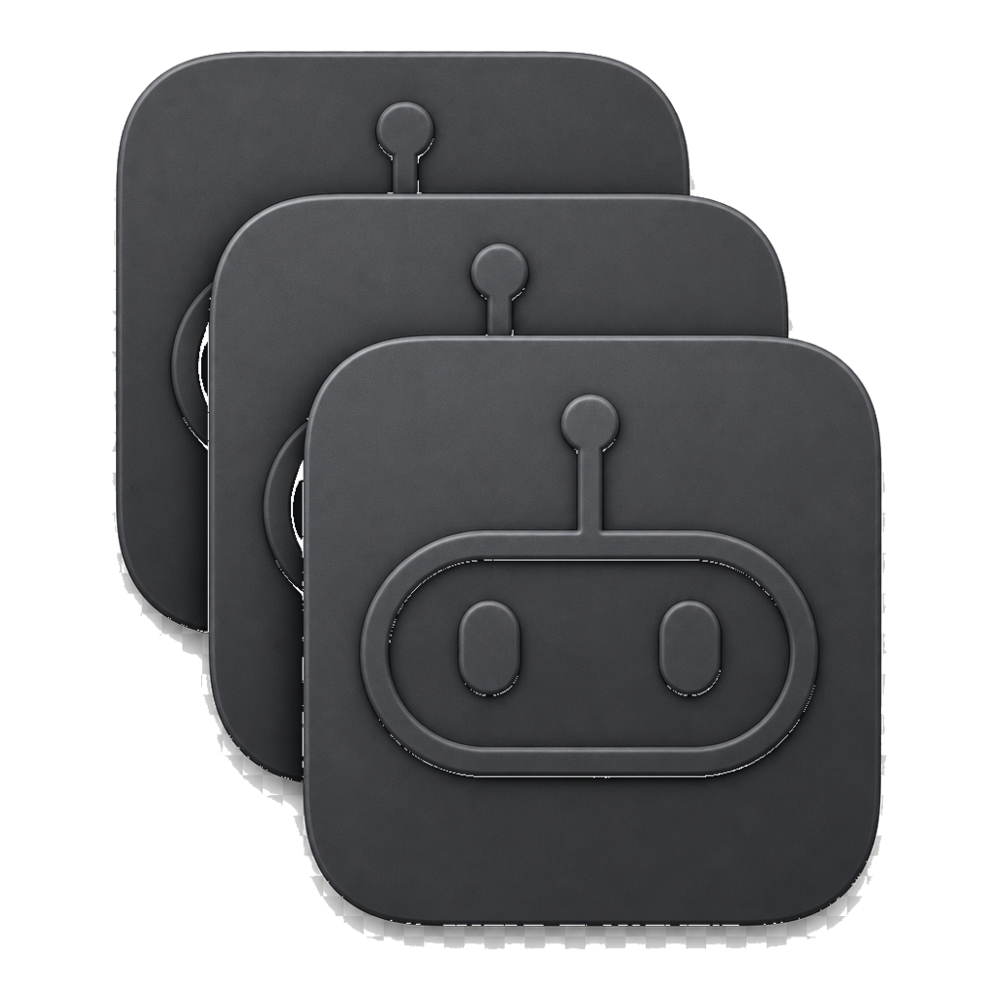

# Lots of Agents

**Run multiple signed-in copies of your AI coding apps on one Mac.**

Grok Bot, Cursor, Claude, and ChatGPT (Codex) don’t give you a clean work/personal switcher. Lots of Agents launches the **same installed app** with a private data folder per clone — so Work and Personal stay signed in at the same time.

One binary. Update once. Every clone picks it up. No copying `.app` bundles.

Not affiliated with xAI, Anysphere, Anthropic, or OpenAI.

<p align="center">
  
</p>

## Who it’s for

You have two Cursor / Grok / Claude / ChatGPT logins (work + personal, client + side project) and you’re tired of signing out, using a second Mac user, or juggling browser profiles.

## What you get

- **Isolated logins & chats** — each clone has its own `--user-data-dir` / extensions dir
- **Shared app updates** — still the official app in `/Applications`
- **Dock wrappers** — `Grok Bot Work.app`, `Cursor Personal.app`, etc. in `~/Applications`
- **Optional deeper isolation** — private `~/.cursor` (skills / user rules) via a full-home overlay that still symlinks your real home
- **Tinted icons** — tell clones apart in the Dock without recreating them

Supported today (if installed):

| App | Bundle |
|---|---|
| [Grok Bot](https://cursor.com/bot/onboarding) | `com.anysphere.sand` |
| [Cursor](https://cursor.com) | Cursor |
| [Claude](https://claude.ai/download) | `com.anthropic.claudefordesktop` |
| [ChatGPT](https://chatgpt.com/desktop) (Codex) | `com.openai.codex` |

## Requirements

- macOS 14+
- At least one of the apps above installed under `/Applications`

## Install (early build)

This is an **ad-hoc signed** Mac app. Gatekeeper will warn the first time — that’s expected until a notarized DMG exists.

1. Download the latest `.zip` from [Releases](../../releases) (or build from source below)
2. Unzip and move **Lots of Agents.app** somewhere sensible (`~/Applications` is fine)
3. First open: **right-click → Open** (or System Settings → Privacy & Security → Open Anyway)
4. Create a Work and Personal clone for the app you care about → Launch

Optional quarantine clear if the zip came from a browser:

```bash
xattr -dr com.apple.quarantine ~/Applications/"Lots of Agents.app"
```

This repo does **not** ship Grok Bot, Cursor, Claude, or ChatGPT — only the launcher.

## How a clone works

Same idea for every recipe — official binary, private data:

```text
/Applications/Grok\ Bot.app/Contents/MacOS/Grok\ Bot \
  --user-data-dir=~/Library/Application\ Support/LotsOfAgents/Profiles/<id>/user-data \
  --extensions-dir=…/extensions
```

| Isolated per clone | Shared |
|---|---|
| Account / plan login | The real `.app` + its updates |
| Chats, settings, extensions | Git, SSH, project files |
| Optional private `~/.cursor` | Your real home (symlinked in overlay mode) |

Data: `~/Library/Application Support/LotsOfAgents/`  
Wrappers: `~/Applications/`

## Build from source

```bash
swift run TwoCursorsTests
./scripts/build-app.sh
open "dist/Lots of Agents.app"
```

Universal (arm64 + x86_64) by default. Developer zip:

```bash
./scripts/package-unsigned.sh
```

Notarized DMG (optional, when you have a Developer ID): see [docs/NOTARIZE.md](docs/NOTARIZE.md).

## Privacy

Runs only on your Mac. No analytics. See [PRIVACY.md](PRIVACY.md).

## License

[MIT](LICENSE)
